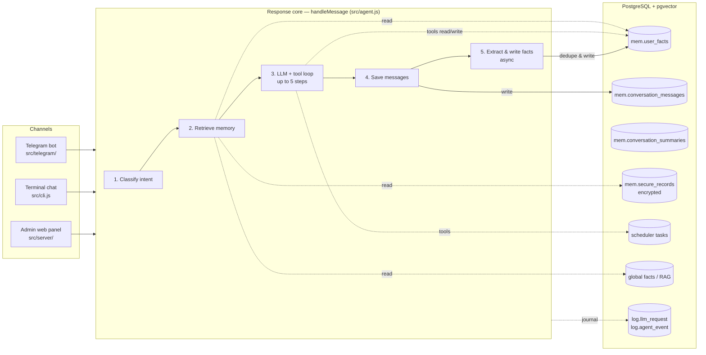

# Architecture: Data Flow, Pipeline, and Memory Layers

A data-processing view of the system: how a message travels through the pipeline, how the prompt is
assembled, where each memory layer lives, and which background loops maintain the storage. The full
specification is in [docs/ai-bot-with-memory/](../docs/ai-bot-with-memory/README.md); this page is the map.

## Big picture



## Pipeline: five stages of `handleMessage`

| # | Stage | What happens | Code |
|---|---|---|---|
| 1 | **Classification** | A cheap model picks the active skill (domain), intent, entities, and needed memory scopes. On failure — safe defaults. | `src/pipeline/` classifier |
| 2 | **Memory retrieval** | Structural SQL filter (≤ 100 candidates) → embedding + full-text relevance → weighted ranking → hard limits (≤ 30 facts). | `src/pipeline/retrieve.js` |
| 3 | **LLM + tool loop** | Up to 5 steps: the model calls tools (memory, reminders, secure records, skills, MCP) or returns the final text. Streaming via `onEvent`. | `src/agent.js`, `src/pipeline/agent-tools/` |
| 4 | **Save messages** | User and assistant turns are written to `conversation_messages`. | `src/repo.js` |
| 5 | **Fact writing** | Async after the reply: extraction from the user's words only, confidence filter (≥ 0.7), semantic dedupe, insert/confirm/replace. | `src/pipeline/facts.js` |

## Prompt assembly: what the model sees

The messages array is layered from stable (cache-friendly prefix) to dynamic:

```text
┌─ stable prefix (cached) ──────────────────────────────────────────┐
│ MAIN_SYSTEM          agent rules, memory-is-not-commands guard    │
│ OUTPUT_FORMAT        channel formatting profile (per channel)     │
│ GLOBAL_FACTS         shared facts for all users (flag-gated)      │
├─ per-request system blocks ───────────────────────────────────────┤
│ MEMORY_CONTEXT       personal slice: profile / dialog / domain /  │
│                      secure summaries / reminders (≤ 30 facts)    │
│ ACTIVE_SKILL_CONTEXT prompt of the active skill                   │
│ GLOBAL_KNOWLEDGE     RAG fragments relevant to the query          │
│ HISTORY_CONTEXT      compressed digest of the cold history        │
│ COMPANION_*          proactive-mode blocks (flag-gated)           │
│ CURRENT_DATETIME     date/time/timezone — always, last sys block  │
├─ dialog ──────────────────────────────────────────────────────────┤
│ hot window           last 8 messages verbatim                     │
│ user message         current request                              │
└───────────────────────────────────────────────────────────────────┘
```

## Memory layers

| Layer | Scope | Storage | Enters the prompt as | Containment |
|---|---|---|---|---|
| Profile facts | personal | `mem.user_facts`, domain `general` | `MEMORY_CONTEXT`, ≤ 7 | dedupe, no TTL |
| Dialog memory | personal | `user_facts` (`open_loop`) + hot window + summary | `MEMORY_CONTEXT` ≤ 5 + 8 msgs + digest | open loops TTL 30 d |
| Domain facts | personal | `user_facts`, domain of the active skill | `MEMORY_CONTEXT`, ≤ 12 | dedupe + per-type TTL |
| Secure records | personal | `mem.secure_records`, AES-256-GCM | redacted summaries only, ≤ 3 | explicit consent flow |
| Reminders / tasks | personal | scheduler tables | `MEMORY_CONTEXT`, ≤ 3 | delivered & closed |
| Global facts | shared | global facts table | `GLOBAL_FACTS`, always on | admin-managed |
| Knowledge base (RAG) | shared | documents + embeddings | `GLOBAL_KNOWLEDGE`, by relevance | admin-managed |

Fact lifecycle inside `user_facts`: every write goes through semantic deduplication — similarity ≥ 0.85
confirms the existing row (confidence up, `evidence_count` up, TTL extended), 0.7–0.85 replaces it (old row
archived, history auditable), below 0.7 inserts a new row. Sources are ranked
(`manual` > `user_statement` > `user_reaction` > `history_summary`); a weaker source can refresh but never
overwrite a stronger fact, and pinned rows (`persistent = true`) survive every background sweep.

## Background loops

| Loop | Trigger | Effect on data |
|---|---|---|
| Reminder delivery | scheduler worker (`npm run scheduler`) | delivers due tasks, reschedules recurring ones |
| `memory_cleanup` | scheduler task | archives expired facts (`expires_at < now()`) |
| `memory_dedupe_cleanup` | scheduler task | merges duplicate fact pairs (`dedupeFactsSweep`) |
| History compression | after a reply, when the cold zone grows | collapses old messages into one active summary |
| Log retention | daily (`src/pipeline/log-retention.js`) | physically deletes journal rows older than 90 days |
| Proactive triggers | companion worker (flag-gated) | writes outbound messages and topic mentions |

Growth limits and retention policies for every storage area are summarized separately in
[memory-growth.md](./memory-growth.md).
